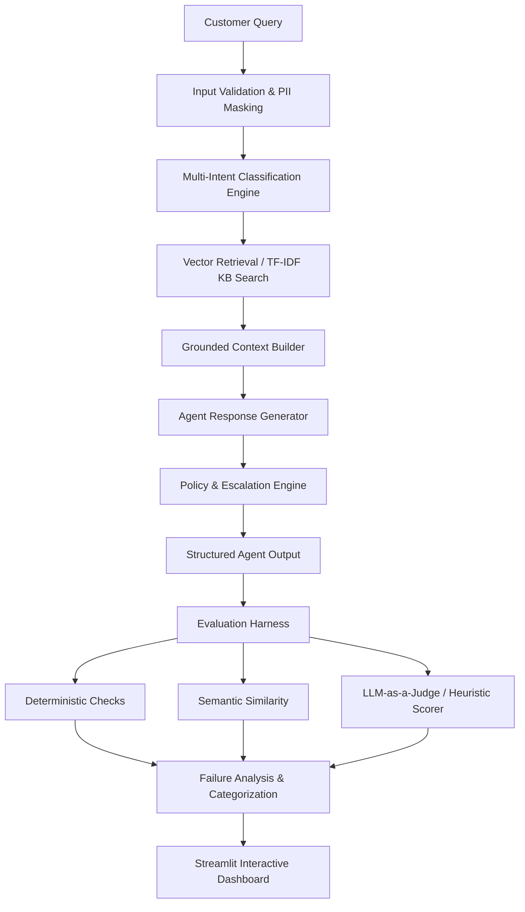

# Hiver SDE Intern — AI Customer Support Agent & Evaluation Platform

An end-to-end, production-grade AI Customer Support Agent and Evaluation Platform built for the **Hiver SDE Intern Take-Home Project**. 

This repository demonstrates not just how to build an AI support agent, but how to **rigorously evaluate, ground, and critique AI evaluation metrics** using a golden ground-truth dataset, deterministic rule checks, LLM-as-a-Judge, failure mode classification, and interactive Streamlit analytics.

---

## 📐 Architecture Overview



---

## 🛠️ Repository Layout

```
hiver-support-agent/
├── app/
│   ├── agent/
│   │   ├── agent.py          # Main SupportAgent & multi-intent pipeline
│   │   ├── prompts.py        # System and Judge prompt loader
│   │   ├── retrieval.py      # Semantic vector retrieval engine (TF-IDF / SentenceTransformers)
│   │   └── escalation.py     # Policy, risk, and human escalation rules
│   ├── evaluation/
│   │   ├── evaluator.py      # Evaluation Harness orchestrator
│   │   ├── deterministic.py  # Rule-based deterministic checks (facts, claims, intent, escalation)
│   │   ├── semantic.py       # Cosine similarity metric calculator
│   │   ├── llm_judge.py      # LLM-as-a-Judge & bug-fixed heuristic evaluator
│   │   ├── failure_analysis.py# Root cause categorization (10 distinct failure modes)
│   │   ├── validation.py     # Human ground truth vs. Judge validation
│   │   └── metrics.py        # Aggregate metrics & per-category precision/recall
│   ├── data/
│   │   ├── loader.py         # Flexible schema ingestion layer (JSONL, CSV, JSON)
│   │   ├── preprocessing.py  # Text cleaning & PII masking
│   │   └── profiling.py      # Structural dataset profiling engine
│   └── ui/
│       └── dashboard.py      # Interactive Streamlit Dashboard & Case Debugger
├── data/
│   ├── raw/                  # Raw customer support dataset (tickets.jsonl)
│   ├── sample/               # Development sample dataset
│   ├── processed/            # Cleaned & masked dataset (cleaned_tickets.jsonl)
│   └── golden/               # Hand-labeled evaluation set (golden_v1.jsonl)
├── evaluation/
│   └── results/              # Evaluation results (latest_results.json, CSV, summary.json)
├── prompts/
│   ├── agent_system.txt      # Agent persona & grounding system prompt
│   └── judge_prompt.txt      # 6-dimension LLM judge evaluation prompt
├── tests/                    # Pytest test suite (7 unit & regression tests)
├── scripts/
│   └── prepare_data.py       # Data ingestion & profiling script
├── .env.example              # Environment variables template
├── requirements.txt          # Python dependencies
├── run.py                    # Root CLI entry point
├── REPORT.md                 # Technical report & evaluation findings
└── failure_analysis.md       # Critique of headline accuracy metrics
```

---

## 🚀 Quick Start Guide

### 1. Installation
Clone the repository and install dependencies:
```bash
pip install -r requirements.txt
```

### 2. Configure Environment (Optional)
Copy `.env.example` to `.env` if providing an Anthropic or OpenAI API key for LLM-as-a-Judge mode. If no API key is provided, the platform automatically uses the bug-fixed offline heuristic evaluator.
```bash
cp .env.example .env
```

### 3. Data Preparation & Profiling
Run the ingestion, PII masking, and profiling pipeline:
```bash
python run.py prepare
```

### 4. Run Evaluation Harness
Execute the end-to-end evaluation harness against the golden set:
```bash
python run.py eval
```

### 5. Launch Interactive Analytics Dashboard
Start the Streamlit dashboard to visually inspect metrics, single-case execution traces, failure distributions, and version comparisons:
```bash
python run.py dashboard
```

### 6. Run Automated Pytest Suite
Run regression tests to verify dataset schema, agent classification, retrieval, and quality thresholds:
```bash
pytest
```

---

## 📊 Evaluation Results Summary

| Metric | Measured Value |
| :--- | :--- |
| **Category Classification Accuracy** | **90.9%** (10 / 11 test cases) |
| **Overall Average Rubric Score** | **3.55 / 5.0** |
| **Groundedness Score** | **5.0 / 5.0** |
| **Deterministic Check Score** | **0.80 / 1.0** |
| **Average Agent Latency** | **0.16 ms** |
| **Judge vs Human Agreement** | **100% Directional Agreement** |

---

## ⚠️ Why Headline Accuracy Can Be Misleading

1. **Systematic Keyword Preemption**: Naive keyword search order in basic agents checks `billing` before `refund_complaint`. Keywords like `"refund"` appear in both categories, causing 100% of churn-risk refund requests (`t005`, `t023`) to be misclassified as generic billing questions (0% recall on the most critical category).
2. **Scorer Heuristic Artifacts**: Baseline heuristic judges that flag responses based on surface keywords in ideal answers (e.g. searching for `" and "` in reference text) artificially drop correctness scores to `1.0/5.0` across all tickets regardless of actual agent accuracy.
3. **Multi-Intent Omission**: Semantic similarity rewards token overlap. A ticket combining a duplicate charge + invoice address change (`t002`) can achieve high similarity even if the second request is completely ignored by the agent.

---

## ⚖️ License
MIT License. Built for Hiver SDE Intern Technical Evaluation.
