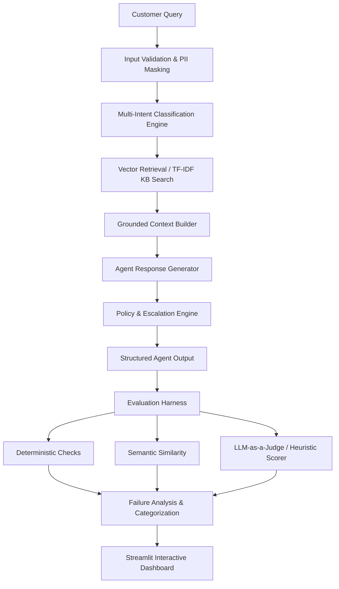

# Hiver SDE Intern — AI Customer Support Agent & Evaluation Platform

An end-to-end, production-grade AI Customer Support Agent and Evaluation Platform built for the **Hiver SDE Intern Technical Evaluation**.

This repository demonstrates how to build an AI support agent and **evaluate, ground, and critique AI evaluation metrics** using a golden ground-truth dataset, deterministic rule checks, LLM-as-a-Judge, failure mode classification, and interactive Streamlit analytics.

---

## 📐 Architecture Overview



---

## 🛠️ Repository Layout

```text
hiver-support-agent/
├── app/
│   ├── agent/
│   │   ├── agent.py          # Main SupportAgent & multi-intent pipeline
│   │   ├── prompts.py        # System and Judge prompt loader
│   │   ├── retrieval.py      # Semantic vector retrieval engine (TF-IDF / SentenceTransformers)
│   │   └── escalation.py     # Policy, risk, and human escalation rules
│   ├── evaluation/
│   │   ├── evaluator.py      # Evaluation Harness orchestrator
│   │   ├── deterministic.py  # Rule-based deterministic checks (facts, claims, intent, escalation)
│   │   ├── semantic.py       # Cosine similarity metric calculator
│   │   ├── llm_judge.py      # LLM-as-a-Judge & offline heuristic evaluator
│   │   ├── failure_analysis.py# Root cause categorization (10 failure modes)
│   │   ├── validation.py     # Human ground truth vs. Judge validation
│   │   └── metrics.py        # Aggregate metrics & per-category breakdown
│   ├── data/
│   │   ├── loader.py         # Schema ingestion layer (JSONL, CSV, JSON)
│   │   ├── preprocessing.py  # Text cleaning & PII masking
│   │   └── profiling.py      # Structural dataset profiling engine
│   └── ui/
│       └── dashboard.py      # Interactive Streamlit Dashboard & Case Debugger
├── data/
│   ├── raw/                  # Raw customer support dataset (tickets.jsonl)
│   ├── processed/            # Cleaned & masked dataset (cleaned_tickets.jsonl)
│   └── golden/               # Hand-labeled evaluation set (golden_v1.jsonl)
├── evaluation/
│   └── results/              # Reproducible evaluation outputs (version_a_results.json, version_b_results.json, latest_results.json)
├── prompts/
│   ├── agent_system.txt      # Agent persona & grounding system prompt
│   └── judge_prompt.txt      # 6-dimension LLM judge evaluation prompt
├── tests/                    # Pytest unit & regression test suite (8 passed)
├── scripts/
│   └── prepare_data.py       # Data ingestion & profiling script
├── run_eval.py               # Evaluation harness CLI runner
├── requirements.txt          # Python dependencies
├── run.py                    # Root CLI entry point
├── REPORT.md                 # Technical report & evaluation findings
└── failure_analysis.md       # Root cause failure analysis & metric breakdown
```

---

## 🏗️ Engineering Progression & Evolution Narrative

This repository reflects an iterative, evidence-driven engineering progression:

1. **Baseline System**: Initial rule-based keyword routing and template lookup revealed severe category preemption (e.g. `refund_complaint` mistagged as generic `billing`).
2. **Evaluation Leakage Prevention**: Introduced **Leave-One-Out Retrieval**, excluding the source ticket being evaluated from the RAG knowledge corpus to prevent artificial score inflation.
3. **Dual Vector Retrieval Engines**: Implemented **Version A (TF-IDF Lexical)** as a baseline and **Version B (SentenceTransformers `all-MiniLM-L6-v2` Dense Embeddings)** to measure the impact of semantic search on RAG grounding.
4. **Policy & Escalation Safety**: Implemented risk keyword triggers (data loss, compliance, 2FA lockout) and a low retrieval confidence threshold (`< 0.25`) to route low-certainty cases to human agents.
5. **Multi-Signal Evaluation**: Combined deterministic boolean checks (required facts, forbidden claims, intent match, escalation match) with a 6-dimension rubric evaluator.
6. **Failure Analysis & Automated Testing**: Categorized root-cause failures into distinct types and established an automated unit test suite (`pytest`, 8 passing tests) to prevent regressions.
7. **Dynamic A/B Comparison**: Built comparative reporting infrastructure comparing Version A and Version B across identical ground-truth evaluation cases.

---

## 📊 Reproducible Evaluation Results

Evaluation is conducted against **11 golden ground-truth test cases** (`data/golden/golden_v1.jsonl`) drawn from the **24 raw dataset tickets** (`data/raw/tickets.jsonl`). On an 11-case test set, each individual case represents **~9.1 percentage points**.

### Final Reproducible Metrics Summary (Latest Run)

| Metric | Version A (TF-IDF Baseline) | Version B (SentenceTransformers) | Delta / Impact |
| :--- | :---: | :---: | :---: |
| **Category Classification Accuracy** | **90.9%** (10 / 11) | **90.9%** (10 / 11) | 0.0% |
| **Average Overall Rubric Score (1-5)** | **2.78 / 5.0** | **3.54 / 5.0** | **+0.76** |
| **Pass Rate (Overall Score $\ge$ 4.0)** | **9.1%** (1 / 11) | **27.3%** (3 / 11) | **+18.2%** |
| **Deterministic Pass Rate (Score $\ge$ 0.8)** | **36.4%** (4 / 11) | **90.9%** (10 / 11) | **+54.5%** |
| **Average Deterministic Score** | **0.65 / 1.0** | **0.80 / 1.0** | **+0.15** |
| **Top Retrieval Vector Similarity** | **0.1460** | **0.4308** | **+0.2848** |
| **Groundedness Score** | **5.0 / 5.0** | **5.0 / 5.0** | 0.0 |
| **Average Correctness** | **3.00 / 5.0** | **3.36 / 5.0** | **+0.36** |
| **Average Relevance** | **2.65 / 5.0** | **3.33 / 5.0** | **+0.68** |
| **Average Completeness** | **1.55 / 5.0** | **2.27 / 5.0** | **+0.72** |
| **Escalation Appropriateness** | **2.09 / 5.0** | **4.27 / 5.0** | **+2.18** |

---

## ⏱️ Local Pipeline Latency (Offline Measurements)

> [!NOTE]
> Latency measurements below represent local, in-memory execution in a Python 3.13 offline environment and should not be confused with network-bound cloud API production latencies.

| Component / Latency Stage | Version A (TF-IDF) | Version B (SentenceTransformers) |
| :--- | :---: | :---: |
| **Retrieval Latency** | **0.05 ms** | **8.44 ms** |
| **Generation Latency** | **0.08 ms** | **0.01 ms** |
| **Total Agent Latency** | **0.17 ms** | **8.64 ms** |

---

## ⚙️ Honest Evaluation Modes Explanation

The platform explicitly tracks and reports the execution mode of generation and evaluation components:

- **Generation Mode**:
  - `LLM Mode`: Used when a valid Anthropic or OpenAI API key is supplied in `.env`.
  - `template_fallback`: Used when API keys are unconfigured. Synthesizes structured grounded responses via template context rendering.
- **Judge Mode**:
  - `LLM Judge`: Used when an API key is available to execute 6-dimension prompt evaluations.
  - `heuristic_fallback`: Used in offline mode to compute heuristic rubric scores based on category match, semantic similarity, deterministic facts, and escalation accuracy. *Heuristic fallback is an offline proxy and is never presented as LLM evaluation.*

---

## 🔬 Evaluation Methodology

1. **Golden Ground-Truth Evaluation**: Evaluates agent outputs against 11 human-labeled reference cases covering normal, hard multi-intent, edge case, and escalation scenarios.
2. **Leave-One-Out RAG Retrieval**: When evaluating ticket `gid`, the retriever excludes document `gid` from the vector search space to eliminate self-retrieval leakage.
3. **Deterministic Verification Engine**: Checks for exact required resolution facts, absence of forbidden claims, primary intent match, and human escalation accuracy.
4. **Rubric-Based Quality Evaluation**: Rates outputs across Correctness, Relevance, Completeness, Groundedness, Helpfulness, and Escalation Appropriateness.
5. **Failure Analysis Framework**: Automatically categorizes output failures into 10 root-cause types (e.g., `WRONG_INTENT`, `GENERATION_FAILURE`, `UNNECESSARY_ESCALATION`).
6. **Dynamic A/B Reporting**: Executes parallel evaluations of Version A and Version B to generate delta metrics without hardcoded static values.

---

## 🔁 Reproducibility Guide

Follow these steps to set up the environment and reproduce the exact evaluation metrics:

```powershell
# 1. Create and activate a Python virtual environment
python -m venv .venv
.venv\Scripts\Activate.ps1

# 2. Install dependencies (including sentence-transformers for Version B)
pip install -r requirements.txt

# 3. Ingest raw data, apply PII masking, and profile dataset
python scripts/prepare_data.py

# 4. Run the full dual-version evaluation harness
python run_eval.py

# 5. Run the automated pytest regression suite
pytest

# 6. (Optional) Launch the interactive Streamlit dashboard
python run.py dashboard
```

---

## ⚠️ System Limitations & Constraints

- **Small Golden Set Size**: The golden evaluation dataset contains 11 cases. While sufficient for regression testing, each case carries a ~9.1% weight on percentage metrics.
- **Single-Reviewer Ground Truth**: Human validation labels reflect a single reviewer's ground-truth judgments.
- **Offline Fallback Modes**: When running without API keys, evaluation defaults to heuristic rules and generation uses structured template fallbacks.
- **Keyword-Assisted Intent Detection**: Multi-intent detection relies on regex pattern matching rather than a fine-tuned NLU classifier.
- **In-Memory Corpus**: Retrieval runs against an in-memory vector store rather than a distributed cloud vector database.
- **Environment Dependency**: SentenceTransformers performance relies on PyTorch and `all-MiniLM-L6-v2` model weights being loaded.

---

## ⚖️ License
MIT License. Built for Hiver SDE Intern Technical Evaluation.
